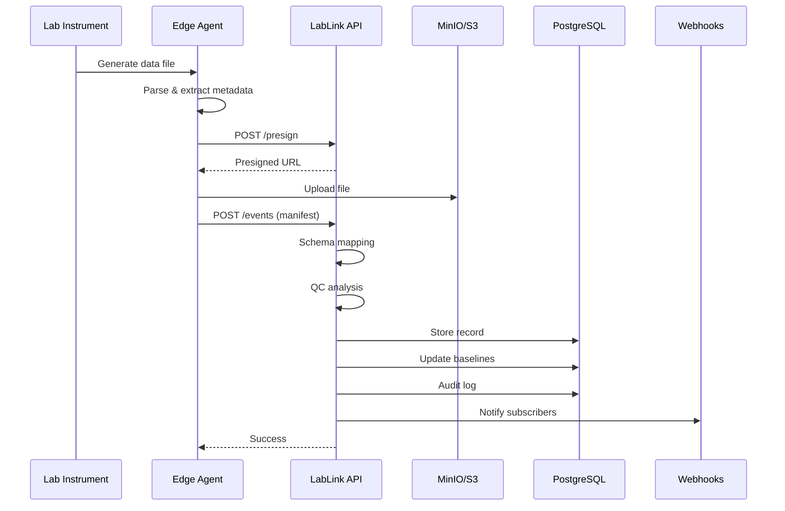

# LabLink AI

**Lab Data Middleware Platform for Biotechnology and Life Sciences**

This tool provides a unified data pipeline for laboratory instrument data, featuring:
- Automated file parsing for multiple instrument formats
- AI-powered semantic schema mapping using embeddings
- Quality control with anomaly detection and drift monitoring
- Standardized output formats (LabLink Standard Format, Allotrope Simple Model)
- 21 CFR Part 11 compliant audit logging
- Real-time webhook notifications

---

### Data Flow



---

## Quick Start

### Prerequisites

- Docker & Docker Compose (v2.0+)
- Make (optional, for convenience commands)

### 1. Clone and Configure

```bash
git clone <repository-url>
cd LabLinkAI-MVP

# Create environment file
cp .env.example .env
# Edit .env if needed (defaults work for local development)
```

### 2. Start Services

```bash
# Using Make (recommended)
make init

# Or using Docker Compose directly
docker compose up -d --build
```

### 3. Verify Installation

```bash
# Check service health
make health

# Or curl directly
curl http://localhost:8000/api/v1/health
```

---

## Usage

### Using the Edge Agent

The edge agent watches a folder for new lab data files and automatically uploads them:

```bash
# Create watch folder
mkdir -p sample_data/incoming

# Start edge agent (on host, not in Docker)
cd edge
pip install -r requirements.txt
python agent.py --watch ../sample_data/incoming --api http://localhost:8000 --org demo-lab
```

### Drop a Test File

```bash
# Create a test CSV file
make edge-test

# Or manually:
echo -e "time,temperature,yield\n0,37.1,0.80\n1,38.5,0.76\n2,36.9,0.85" > sample_data/incoming/test.csv
```

### Query Processed Files

```bash
curl "http://localhost:8000/api/v1/files?org_id=demo-lab"
```

### Get Normalized Data

```bash
# LabLink Standard Format
curl "http://localhost:8000/api/v1/files/1/normalized?format=lablink"

# Allotrope Simple Model
curl "http://localhost:8000/api/v1/files/1/normalized?format=asm"
```

---

## Make Commands

```bash
make help            # Show all available commands

# Development
make up              # Start development environment
make down            # Stop all services
make logs            # View all logs
make logs-api        # View API logs only
make shell           # Open shell in API container
make shell-db        # Open psql shell

# Database
make migrate         # Run migrations
make migrate-new MSG="description"  # Create new migration
make migrate-history # Show migration history

# Testing
make test            # Run tests
make test-cov        # Run tests with coverage

# Production
make up-prod         # Start production environment
make build-prod      # Build production images

# Cleanup
make clean           # Remove stopped containers
make reset           # Full reset (WARNING: deletes data!)
```

---

## Environment Variables

See `.env.example` for all available options. Key variables:

### API Configuration

| Variable | Default | Description |
|----------|---------|-------------|
| `API_HOST` | `0.0.0.0` | API bind address |
| `API_PORT` | `8000` | API port |
| `LOG_LEVEL` | `INFO` | Logging level (DEBUG, INFO, WARNING, ERROR) |
| `JSON_LOGS` | `true` | JSON-formatted logs for production |

### PostgreSQL

| Variable | Default | Description |
|----------|---------|-------------|
| `POSTGRES_USER` | `postgres` | Database user |
| `POSTGRES_PASSWORD` | `postgres` | Database password |
| `POSTGRES_DB` | `lablink` | Database name |
| `POSTGRES_HOST` | `postgres` | Database host |
| `POSTGRES_PORT` | `5432` | Database port |

### S3/MinIO Storage

| Variable | Default | Description |
|----------|---------|-------------|
| `S3_ENDPOINT` | `http://minio:9000` | S3 endpoint URL |
| `S3_REGION` | `us-east-1` | AWS region |
| `S3_ACCESS_KEY` | `minioadmin` | Access key |
| `S3_SECRET_KEY` | `minioadmin` | Secret key |
| `S3_BUCKET` | `lablink` | Bucket name |
| `S3_SECURE` | `false` | Use HTTPS |

---

## Database Migrations

LabLink uses Alembic for database migrations.

### Run Migrations

```bash
# Apply all pending migrations
make migrate

# Or inside the container
docker compose exec api alembic upgrade head
```

### Create New Migration

```bash
# Auto-generate from model changes
make migrate-new MSG="add user table"

# Or manually
docker compose exec api alembic revision -m "add user table"
```

### Rollback

```bash
# Rollback one migration
make migrate-down

# Rollback to specific revision
docker compose exec api alembic downgrade <revision>
```

### Migration Best Practices

1. Always review auto-generated migrations before applying
2. Test migrations on a copy of production data
3. Backup database before running migrations in production
4. Keep migrations small and focused

---

## API Endpoints

### Core Endpoints

| Method | Endpoint | Description |
|--------|----------|-------------|
| `POST` | `/api/v1/presign` | Get presigned URL for upload |
| `POST` | `/api/v1/events` | Submit file manifest |
| `GET` | `/api/v1/files` | List processed files |
| `GET` | `/api/v1/files/{id}/normalized` | Get normalized data |

### Quality Control

| Method | Endpoint | Description |
|--------|----------|-------------|
| `GET` | `/api/v1/baselines` | List baselines |
| `POST` | `/api/v1/baselines/reset` | Reset baselines |
| `GET` | `/api/v1/baselines/{instrument}/{field}` | Get baseline details |

### Webhooks

| Method | Endpoint | Description |
|--------|----------|-------------|
| `GET` | `/api/v1/webhooks` | List subscriptions |
| `POST` | `/api/v1/webhooks` | Create subscription |
| `DELETE` | `/api/v1/webhooks/{id}` | Delete subscription |
| `POST` | `/api/v1/webhooks/{id}/test` | Test webhook |

### Audit & System

| Method | Endpoint | Description |
|--------|----------|-------------|
| `GET` | `/api/v1/audit` | Query audit logs |
| `GET` | `/api/v1/audit/verify` | Verify audit chain |
| `GET` | `/healthz` | Simple health check |
| `GET` | `/api/v1/health` | Detailed health check |
| `GET` | `/api/v1/circuit-breakers` | Circuit breaker status |

---

## Production Deployment

### Using Docker Compose

```bash
# Build and start production services
docker compose -f docker-compose.yml -f docker-compose.prod.yml up -d --build

# Or use Make
make up-prod
```

### Production Checklist

- [ ] Update `.env` with strong passwords
- [ ] Configure external PostgreSQL (RDS) if needed
- [ ] Configure external S3 if needed
- [ ] Set `LOG_LEVEL=INFO` and `JSON_LOGS=true`
- [ ] Configure reverse proxy (nginx/traefik) with TLS
- [ ] Set up log aggregation (ELK, CloudWatch, etc.)
- [ ] Configure monitoring and alerting
- [ ] Run database migrations
- [ ] Test webhook endpoints

### AWS Deployment

For AWS deployment, update environment variables:

```bash
# .env for AWS
POSTGRES_HOST=your-rds-instance.region.rds.amazonaws.com
S3_ENDPOINT=https://s3.us-east-1.amazonaws.com
S3_ACCESS_KEY=<iam-access-key>
S3_SECRET_KEY=<iam-secret-key>
S3_SECURE=true
```

---

## Troubleshooting

### Services Won't Start

```bash
# Check service status
make status

# View logs for errors
make logs

# Rebuild from scratch
make clean
make up-build
```

### Database Connection Errors

```bash
# Check if PostgreSQL is healthy
docker compose ps postgres

# Check PostgreSQL logs
make logs-db

# Try connecting manually
make shell-db
```

### API Returns 500 Errors

```bash
# Check API logs
make logs-api

# Check health endpoint
curl http://localhost:8000/api/v1/health

# Check circuit breakers
curl http://localhost:8000/api/v1/circuit-breakers
```

### MinIO/S3 Upload Failures

```bash
# Check MinIO logs
make logs-minio

# Verify MinIO is accessible
curl http://localhost:9000/minio/health/live

# Check bucket exists (via MinIO console)
open http://localhost:9001
```

### Edge Agent Not Processing Files

```bash
# Check agent is running
ps aux | grep agent.py

# Check API connectivity
curl http://localhost:8000/healthz

# Check agent logs (run with --debug)
python agent.py --watch ./incoming --api http://localhost:8000 --org demo-lab --debug
```

### Migration Errors

```bash
# Check current migration status
make migrate-current

# View migration history
make migrate-history

# Manual rollback if needed
docker compose exec api alembic downgrade -1
```

### Port Already in Use

```bash
# Find what's using the port
lsof -i :8000

# Kill the process or change port in docker-compose.yml
```

### Reset Everything

```bash
# WARNING: This deletes all data!
make reset
```

---

## Support

- **Issues:** [GitHub Issues](https://github.com/your-org/lablink-ai/issues)
- **Documentation:** http://localhost:8000/docs (when running)
- **API Reference:** [docs/api.md](docs/api.md)
